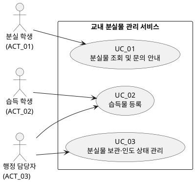

# 교내 분실물 관리 서비스 유스케이스 모델 (UC v0.1)

## 1. 목적 및 식별 기준

본 문서는 고객 요구사항과 SRS v0.1을 바탕으로 사용자가 **무엇을**, **왜** 하려는지에 초점을 맞춰 유스케이스를 식별한다. 유스케이스는 화면의 세부 동작이 아니라 사용자가 완료하려는 **하나의 서비스 단위**로 구분한다. 사진 매칭·자동 알림·개인 휴대전화 번호 공개·학교 인증 연동은 현재 범위에서 제외한다.

## 2. 액터 목록

| 액터 ID | 액터 | 구분 | 역할 및 관심사 |
|---|---|---|---|
| ACT_01 | 분실 학생 | 주 액터 | 행정실을 방문하기 전에 잃어버린 물품의 보관 여부·위치를 확인하고, 필요하면 담당 부서에 문의하려 한다. |
| ACT_02 | 습득 학생 | 주 액터 | 습득한 물품을 앱에서 바로 등록하여 분실자가 물품 정보를 확인할 수 있도록 하려 한다. |
| ACT_03 | 행정 담당자 | 주 액터 | 분실물 센터의 습득 물품을 등록하고, 물품이 보관 중인지 인도 완료됐는지 관리하여 반복 문의를 줄이려 한다. |
| ACT_04 | 정보보호 담당자 | 이해관계자 | 조회 화면의 공개 정보 범위를 검토한다. 현재 명세에는 별도 시스템 조작 기능이 확정되어 있지 않다. |
| ACT_05 | 서비스 운영 책임자 | 이해관계자 | 운영 정책과 책임 주체를 결정한다. 현재 명세에는 별도 시스템 조작 기능이 확정되어 있지 않다. |

## 3. 유스케이스 목록

| UC ID | 유스케이스 | 상태 | 주 액터 | 사용자 목표 서술 (무엇을 / 왜) | 관련 요구사항 |
|---|---|---|---|---|---|
| UC_01 | 분실물 조회 및 문의 안내 | 확정 | 분실 학생 | 잃어버린 물품의 보관 여부·위치를 조회하고, 필요하면 담당 부서의 문의 방법을 확인하여 불필요한 방문과 개인 연락처 공개 없이 문제를 해결하려 한다. | NEEDS_1, NEEDS_4, FR_01, FR_04, NFR_01, NFR_04, Pol_03, Pol_06 |
| UC_02 | 습득물 등록 | 확정 | 습득 학생, 행정 담당자 | 습득 학생은 습득한 물품을 앱에서 바로 등록하여 분실자가 물품 정보를 확인할 수 있게 하려 하고, 행정 담당자는 분실물 센터의 습득 물품을 관리하기 위해 등록하려 한다. | NEEDS_2, FR_02, NFR_02 |
| UC_03 | 분실물 보관·인도 상태 관리 | 확정 | 행정 담당자 | 물품을 `보관 중` 또는 `인도 완료`로 기록·구분하여 이미 인도한 물품에 관한 반복 문의를 줄이려 한다. | NEEDS_3, FR_03 |

## 4. 유스케이스 다이어그램

## 5. 유스케이스 관계 및 범위 해석

| 관계 / 범위 | 해석 |
|---|---|
| UC_01 | 조회와 문의 안내는 분실 학생이 “물품을 찾기 위한 정보 확인”을 완료하는 하나의 서비스 단위이므로 하나의 유스케이스로 통합한다. 문의 방법을 별도 화면에서도 직접 확인할 수 있는지 여부는 확정되지 않았다. |
| UC_02와 UC_03 | 습득 학생은 앱에서 직접 등록하고, 행정 담당자도 분실물 센터 관리 목적으로 등록할 수 있다. 행정 담당자는 이후 보관·인도 상태를 관리한다. 등록 내용의 검토·승인 또는 인수 절차가 필요한지는 확정되지 않았다. |
| 습득물 접수 장소 안내 | 서비스 내 제공 여부가 미정이므로 현재 유스케이스 다이어그램에는 포함하지 않는다. 질문 사항에서 고객 결정을 요청한다. |
| 제외 기능 | 사진 업로드·유사 물품 매칭, 매칭 결과 자동 알림, 개인 휴대전화 번호 공개, 실제 개인정보 사용, 학교 인증 연동은 다이어그램과 유스케이스 범위에서 제외한다. |

## 6. 질문 사항

| Q ID | 고객에게 확인할 질문 | 관련 유스케이스 / 영향 |
|---|---|---|
| Q_01 | 분실 학생은 어떤 조건(예: 물품 분류, 습득 장소, 습득 일자, 키워드)으로 물품을 조회해야 하나요? | UC_01의 조회 화면 및 검색 방식 |
| Q_02 | UC_01의 조회 결과에 보관 여부·위치 외에 어떤 정보를 공개할 수 있나요? 공개 항목은 정보보호 담당자가 최종 승인하나요? | UC_01, Pol_07 |
| Q_03 | 문의 방법은 조회 결과 안에서만 보여야 하나요, 아니면 별도 안내 화면에서도 바로 볼 수 있어야 하나요? | UC_01 |
| Q_04 | 문의 안내에 표시할 담당 부서명, 연락 방법, 운영 시간 등 구체적인 항목은 무엇인가요? | UC_01 |
| Q_05 | 습득 학생과 행정 담당자가 각각 등록할 때 필수 입력 항목은 동일한가요? 서로 다른 경우, 역할별 항목은 무엇인가요? | UC_02, FR_02 |
| Q_06 | 습득 학생이 앱에서 등록한 물품은 즉시 조회 가능한가요? 아니면 행정 담당자의 물품 인수·검토·승인 후에만 `보관 중`으로 조회되나요? | UC_02, UC_03 |
| Q_07 | 행정 담당자는 습득 학생이 등록한 내용을 수정하거나 반려할 수 있어야 하나요? 가능하다면 그 사유와 이력도 관리해야 하나요? | UC_02, FR_02 |
| Q_08 | `보관 중`에서 `인도 완료`로 상태를 변경할 수 있는 사람은 누구이며, 잘못 변경된 상태는 어떤 절차로 정정하나요? | UC_03 |
| Q_09 | 습득물 접수 장소 안내를 서비스 기능으로 제공할까요? 제공한다면 안내할 장소 정보는 누가 관리하나요? | 후보 기능의 포함 여부 및 운영 |
| Q_10 | 등록 시간·조회 응답 시간 목표치를 적용할 측정 환경과 예상 동시 사용자 수는 얼마인가요? | NFR_02, NFR_04 |
| Q_11 | 서비스 운영 책임자와 공개 정보 검토 책임자는 각각 누구인가요? | 운영 정책, 공개 항목 확정 |
