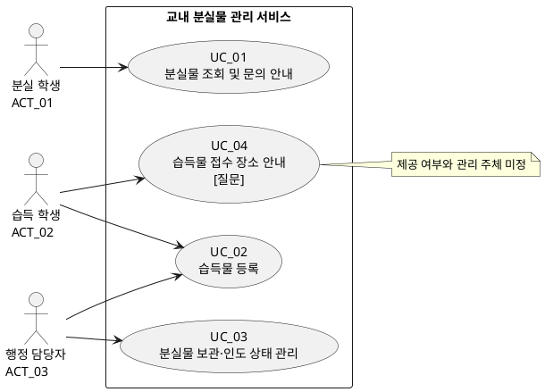

# 소프트웨어 요구사항 명세서 _ v0.1 _ 분실물서비스

## 1. 문서 개요

| 항목 | 내용 |
|---|---|
| 목적 | 교내 분실물 관리 서비스의 1차 개발·검증 기준을 정의한다. |
| 입력 근거 | [고객 요구사항.md](<고객 요구사항.md>), 사용자 검토에서 확정된 등록 주체 결정 |
| 대상 범위 | 분실물 조회·문의 안내, 습득물 등록, 보관·인도 상태 관리 |
| 제외 범위 | 사진 기반 유사 물품 매칭, 자동 알림, 개인 휴대전화 번호 공개, 실제 개인정보 사용, 학교 인증 연동 |
| 표기 | **확정**: 구현·검증 대상 / **질문**: 고객 결정 전 구현을 확정하지 않음 / **제안**: 일반적인 목표치로, 고객 승인 후 확정 |

## 2. 공통 정책·업무 규칙 및 미정 질문

### 2.1 공통 정책·업무 규칙

| ID | 구분 | 내용 | 원문 근거 | 상태 | 검증 방법 |
|---|---|---|---|---|---|
| Pol_01 | 정책 | 시스템과 테스트에는 가상 데이터만 사용하며 실제 개인정보를 수집·저장·표시하지 않는다. | [C_1](<고객 요구사항.md#4-개발-범위와-공통-제약>) | 확정 | 화면·테스트 데이터 점검에서 실제 개인정보 노출 0건 |
| Pol_02 | 정책 | 학교 인증 연동은 이번 개발 범위에 포함하지 않는다. | [C_1](<고객 요구사항.md#4-개발-범위와-공통-제약>) | 확정 | 인증 연동 기능·외부 인증 데이터가 없음 |
| Pol_03 | 정책 | 개인 휴대전화 번호를 서비스의 공개 정보로 표시하지 않는다. | [NEEDS_6](<고객 요구사항.md#5-고객-요구사항-요약>), [SC8](<고객 요구사항.md#4-개발-범위와-공통-제약>) | 확정 | 모든 공개 화면과 테스트 데이터에서 개인 번호 노출 0건 |
| Pol_04 | 정책 | 사진 업로드·사진 기반 유사 분실물 조회 및 사진 매칭 자동 알림은 이번 개발 범위에서 제외한다. | [SC5](<고객 요구사항.md#4-개발-범위와-공통-제약>), [SC7](<고객 요구사항.md#4-개발-범위와-공통-제약>) | 확정 | 해당 기능을 구현·노출하지 않음 |
| BR_01 | 업무 규칙 | 물품 상태는 최소 `보관 중`과 `인도 완료`를 구분해 기록·조회한다. | [NEEDS_3](<고객 요구사항.md#5-고객-요구사항-요약>), [SC3](<고객 요구사항.md#4-개발-범위와-공통-제약>) | 확정 | 상태별 물품이 조회 화면에서 구분됨 |
| BR_02 | 업무 규칙 | 습득 학생은 앱에서 습득 물품을 직접 등록하고, 행정 담당자는 분실물 센터 관리 목적으로 물품을 등록할 수 있다. | 사용자 검토 확정 사항; 원문 [NEEDS_2](<고객 요구사항.md#5-고객-요구사항-요약>) | 확정 | 두 액터 모두 등록 흐름을 완료할 수 있음 |
| BR_03 | 업무 규칙 | 문의는 개인 연락처 공개가 아니라 담당 부서와 정해진 문의 방법의 안내로 제공한다. | [SC6](<고객 요구사항.md#4-개발-범위와-공통-제약>), [SC8](<고객 요구사항.md#4-개발-범위와-공통-제약>) | 확정 | 문의 안내에 개인 번호 대신 담당 부서·문의 방법 표시 |
| Pol_05 | 정책 | 조회 화면의 상세 공개 항목은 정보보호 담당자의 검토를 거쳐 확정한다. | [S4](<고객 요구사항.md#3-고객-인터뷰>), [NEEDS_6](<고객 요구사항.md#5-고객-요구사항-요약>) | 질문 | 공개 항목 승인 기록 확인 |

### 2.2 미정 질문

| ID | 질문 | 원문 근거 | 영향 범위 | 상태 |
|---|---|---|---|---|
| Q_01 | 조회 조건은 무엇인가? (예: 물품 분류, 습득 장소, 습득 일자, 키워드) | SC1 | UC_01, FR_01 | 질문 |
| Q_02 | 조회 화면에 보관 여부·위치 외에 어떤 정보를 공개하는가? 최종 승인자는 누구인가? | S4, NEEDS_6 | UC_01, Pol_05 | 질문 |
| Q_03 | 담당 부서명·문의 방법·운영 시간 중 무엇을 표시하며, 정보가 비어 있을 때 무엇을 보여 주는가? | SC6 | UC_01, FR_02 | 질문 |
| Q_04 | 습득 학생과 행정 담당자의 등록 필수 항목·권한은 같은가? 다르면 어떻게 다른가? | SC2, NEEDS_2 | UC_02, FR_03 | 질문 |
| Q_05 | 습득 학생이 등록한 물품은 즉시 조회 가능한가? 행정 담당자의 인수·검토·승인 후 공개하는가? | 사용자 검토에서 식별 | UC_02, UC_03 | 질문 |
| Q_06 | 등록 내용을 수정·반려할 수 있는 사람, 정정 절차 및 변경 이력 보존 여부는 무엇인가? | SC2, SC3 | UC_02, UC_03 | 질문 |
| Q_07 | 습득물 접수 장소 안내를 서비스 기능으로 제공하는가? 제공한다면 누가 안내 정보를 관리하는가? | S3, SC4, NEEDS_5 | UC_04 | 질문 |
| Q_08 | 등록 부담 감소와 조회 성능의 최종 목표치, 측정 환경, 예상 동시 사용자 수는 무엇인가? | NEEDS_7 | NFR_01~NFR_03 | 질문 |

## 3. 사용자 목표, 액터 및 유스케이스

### 3.1 사용자 목표

| 목표 ID | 사용자와 목표 | 사용자 가치 | 관련 UC |
|---|---|---|---|
| G_01 | 분실 학생이 방문 전에 물품의 보관 여부·위치와 문의 방법을 확인한다. | 불필요한 행정실 방문과 문의를 줄인다. | UC_01 |
| G_02 | 습득 학생이 습득 물품을 앱에서 바로 등록한다. | 분실자가 물품 정보를 확인할 수 있게 한다. | UC_02 |
| G_03 | 행정 담당자가 센터 물품을 등록하고 보관·인도 상태를 관리한다. | 물품 관리와 반복 문의 대응 부담을 줄인다. | UC_02, UC_03 |
| G_04 | 습득 학생이 물품을 맡길 장소를 확인한다. | 습득물을 적절한 장소에 접수한다. | UC_04 (질문) |

### 3.2 액터 목록

| 액터 ID | 액터 | 역할 |
|---|---|---|
| ACT_01 | 분실 학생 | 물품을 조회하고, 필요 시 문의 방법을 확인한다. |
| ACT_02 | 습득 학생 | 습득 물품을 앱에 등록한다. 접수 장소 안내는 제공 여부가 미정이다. |
| ACT_03 | 행정 담당자 | 분실물 센터 물품을 등록하고, 보관·인도 상태를 관리한다. |
| ACT_04 | 정보보호 담당자 | 공개 정보 범위를 검토하는 이해관계자다. 확정된 시스템 조작 유스케이스는 없다. |
| ACT_05 | 서비스 운영 책임자 | 운영 정책·책임을 결정하는 이해관계자다. 확정된 시스템 조작 유스케이스는 없다. |

### 3.3 유스케이스 목록

| ID | UC 명 | 상태 | 주 액터 | 사용자 목표 |
|---|---|---|---|---|
| UC_01 | 분실물 조회 및 문의 안내 | 확정 | ACT_01 | 보관 여부·위치와 필요 시 문의 방법을 확인해 다음 행동을 결정한다. |
| UC_02 | 습득물 등록 | 확정 | ACT_02, ACT_03 | 습득 물품을 등록해 분실자 조회와 센터 관리를 가능하게 한다. |
| UC_03 | 분실물 보관·인도 상태 관리 | 확정 | ACT_03 | 보관 중인 물품과 인도 완료 물품을 구분한다. |
| UC_04 | 습득물 접수 장소 안내 | 질문 | ACT_02 | 습득물을 맡길 장소를 확인한다. |

### 3.4 유스케이스 다이어그램

### 3.5 액터–유스케이스 연결표

| 액터 \ UC | [UC_01](#uc-01) | [UC_02](#uc-02) | [UC_03](#uc-03) | [UC_04](#uc-04) |
|---|---:|---:|---:|---:|
| ACT_01 분실 학생 | 주 액터 |  |  |  |
| ACT_02 습득 학생 |  | 주 액터 |  | 주 액터 (질문) |
| ACT_03 행정 담당자 |  | 주 액터 | 주 액터 |  |

## 4. 유스케이스(UC) 명세

### UC_01 — 분실물 조회 및 문의 안내

| 항목 | 내용 |
|---|---|
| ID, UC 명 | UC_01, 분실물 조회 및 문의 안내 |
| 목표 | 분실 학생이 보관 여부·위치 및 필요한 경우 문의 방법을 확인한다. |
| 액터 | 분실 학생(ACT_01) |
| 출처 | NEEDS_1, NEEDS_4, NEEDS_6, SC1, SC6 |
| 사전 조건 | 조회에 사용할 물품 데이터가 등록되어 있고, 공개 가능한 항목이 설정되어 있다. |
| 트리거 | 분실 학생이 물품 조회를 시작한다. |
| 기본 흐름 | 1. 학생이 조회 조건을 입력한다. 2. 시스템이 조건에 맞는 공개 가능 물품을 조회한다. 3. 시스템이 보관 여부와 위치를 표시한다. 4. 학생이 결과를 확인한다. 5. 학생이 필요 시 문의 안내를 요청한다. 6. 시스템이 담당 부서와 문의 방법을 표시한다. |
| 대안 흐름 | A1. 2단계에서 일치 물품이 없으면, 시스템은 결과 없음을 안내하고 학생은 조회 조건을 바꿔 1단계로 복귀하거나 종료한다. **[논의]** 재조회 방법·문의 안내 동시 제공 여부 필요.  A2. 5단계에서 학생이 문의 안내를 요청하지 않으면, 6단계를 건너뛰고 종료한다. |
| 예외 흐름 | E1. 6단계에서 문의 정보가 설정되지 않았으면, 시스템은 안내 불가를 표시하고 종료한다. **[논의]** 대체 안내·운영자 통보 방식 필요.  E2. 조회 처리 오류가 나면, 시스템은 결과를 확정적으로 표시하지 않고 재시도 가능 여부를 알린다. **[논의]** 오류 메시지·기록 방식 필요. |
| 사후 조건 | 성공: 보관 여부·위치, 요청 시 문의 방법이 제공된다. 실패·취소: 물품 데이터는 변경되지 않으며 실제 개인정보는 보존하지 않는다. 오류·접속 이력 보존 여부는 질문이다. |

### UC_02 — 습득물 등록

| 항목 | 내용 |
|---|---|
| ID, UC 명 | UC_02, 습득물 등록 |
| 목표 | 습득 학생은 앱에서 습득 물품을 바로 등록하고, 행정 담당자는 센터 관리 물품을 등록한다. |
| 액터 | 습득 학생(ACT_02), 행정 담당자(ACT_03) |
| 출처 | NEEDS_2, NEEDS_7, SC2, 사용자 검토 확정 사항 |
| 사전 조건 | 등록 주체가 등록 화면을 열 수 있고, 시스템은 가상 데이터만 사용한다. |
| 트리거 | 습득 학생 또는 행정 담당자가 물품 등록을 시작한다. |
| 기본 흐름 | 1. 등록 주체가 습득물 등록을 선택한다. 2. 시스템이 등록 항목을 표시한다. 3. 등록 주체가 물품 정보를 입력한다. 4. 등록 주체가 등록을 요청한다. 5. 시스템이 입력값을 확인하고 물품 정보를 등록한다. 6. 시스템이 등록 결과를 표시한다. |
| 대안 흐름 | A1. 3~4단계에서 필수 항목이 누락되었거나 형식이 틀리면, 시스템은 보완 항목을 표시하고 3단계로 복귀한다. **[논의]** 역할별 필수 항목·형식 필요.  A2. 4단계에서 사용자가 취소하면, 확정 등록을 하지 않고 종료한다. **[논의]** 임시 저장 여부와 보존 기간 필요.  A3. 5단계에서 습득 학생 등록 건이 인수·승인 대기라면, 시스템은 등록 결과와 대기 상태를 표시하고 종료한다. **[논의]** 승인 절차와 공개 시점 필요. |
| 예외 흐름 | E1. 5단계에서 저장 오류가 나면, 시스템은 등록 성공 여부를 명확히 표시한다. 성공하지 않았으면 3단계로 복귀하거나 종료한다. **[논의]** 재시도·중복 방지·오류 기록 방식 필요. |
| 사후 조건 | 성공: 등록 정보가 가상 데이터로 보존되고, 공개·조회 가능 시점은 운영 절차를 따른다. 실패·취소: 확정 물품 정보는 생성·변경되지 않는다. 임시 입력값 보존 여부는 질문이다. |

### UC_03 — 분실물 보관·인도 상태 관리

| 항목 | 내용 |
|---|---|
| ID, UC 명 | UC_03, 분실물 보관·인도 상태 관리 |
| 목표 | 행정 담당자가 물품 상태를 기록·구분해 보관 물품과 인도 완료 물품을 혼동하지 않는다. |
| 액터 | 행정 담당자(ACT_03) |
| 출처 | NEEDS_3, SC3 |
| 사전 조건 | 대상 물품이 등록되어 있고, 행정 담당자가 상태 관리 권한을 가진다. |
| 트리거 | 행정 담당자가 물품 상태를 확인하거나 변경할 필요가 생긴다. |
| 기본 흐름 | 1. 담당자가 대상 물품을 선택한다. 2. 시스템이 현재 상태를 표시한다. 3. 담당자가 `보관 중` 또는 `인도 완료`를 선택한다. 4. 담당자가 변경을 요청한다. 5. 시스템이 상태를 기록하고 결과를 표시한다. 6. 시스템이 조회 시 변경된 상태를 구분해 표시한다. |
| 대안 흐름 | A1. 1단계에서 대상 물품을 찾지 못하면, 시스템은 대상 없음으로 안내하고 1단계로 복귀하거나 종료한다. **[논의]** 물품 검색·식별 기준 필요.  A2. 3~4단계에서 변경 권한이 없으면, 시스템은 상태를 변경하지 않고 사유를 표시한 뒤 종료한다. **[논의]** 권한 주체·변경 조건 필요.  A3. 5단계 후 잘못 변경된 상태가 확인되면, 정정 절차에 따라 바로잡는다. **[논의]** 정정 권한·승인·변경 이력 보존 필요. |
| 예외 흐름 | E1. 5단계에서 저장 오류가 나면, 시스템은 기존 상태를 유지하고 저장 실패를 표시한다. 담당자는 3단계로 복귀하거나 종료한다. **[논의]** 오류 기록·재시도 방식 필요. |
| 사후 조건 | 성공: 상태가 `보관 중` 또는 `인도 완료`로 보존되고 조회 화면에서 구분된다. 실패·취소: 기존 상태를 유지한다. 실패 기록·변경 이력 보존 여부는 질문이다. |

### UC_04 — 습득물 접수 장소 안내 (질문)

| 항목 | 내용 |
|---|---|
| ID, UC 명 | UC_04, 습득물 접수 장소 안내 |
| 목표 | 습득 학생이 주운 물품을 맡길 장소를 확인한다. |
| 액터 | 습득 학생(ACT_02) |
| 출처 | S3, SC4, NEEDS_5 |
| 사전 조건 | **[논의]** 이 기능을 서비스 범위에 포함한다는 고객 결정이 필요하다. |
| 트리거 | 습득 학생이 물품을 맡길 장소를 알고자 한다. |
| 기본 흐름 | **[논의]** 제공 여부와 안내 정보의 관리 주체가 결정되지 않아 기본 흐름을 확정하지 않는다. |
| 대안·예외 흐름 | **[논의]** 장소 정보 부재·변경 시 안내 방식과 운영 담당자 결정이 필요하다. |
| 사후 조건 | 구현 전: 없음. 범위에 포함될 경우, 습득 학생이 최신 접수 장소 안내를 확인할 수 있어야 한다. |

## 5. 기능 요구사항

| ID | 기능 요구사항 | 연결 UC/단계 | 상태 | 검증 기준 |
|---|---|---|---|---|
| FR_01 | 시스템은 분실 학생이 분실물의 보관 여부와 보관 위치를 조회할 수 있게 해야 한다. | UC_01 기본 흐름 1~4 | 확정 | 등록된 가상 물품의 보관 여부·위치가 조회 결과에 표시됨 |
| FR_02 | 시스템은 분실 학생에게 담당 부서와 정해진 문의 방법을 안내해야 한다. | UC_01 기본 흐름 5~6 | 확정 | 개인 번호 없이 문의 안내 표시 |
| FR_03 | 시스템은 습득 학생의 앱 직접 등록과 행정 담당자의 센터 관리용 등록을 지원해야 한다. | UC_02 기본 흐름 1~6 | 확정 | 두 액터가 물품 등록을 완료할 수 있음 |
| FR_04 | 시스템은 각 물품의 상태를 `보관 중` 또는 `인도 완료`로 기록·구분해야 한다. | UC_03 기본 흐름 1~6 | 확정 | 상태 변경 후 조회 화면에서 구분됨 |
| FR_05 | 시스템은 습득물 접수 장소를 안내해야 한다. | UC_04 | 질문 | 서비스 포함 여부·안내 정보 관리 주체 확정 후 정의 |

## 6. 비기능 요구사항: 품질 요구사항과 제약 조건

### 6.1 품질 요구사항

| ID | 요구사항 | 원문 근거 | 상태 | 검증 기준 |
|---|---|---|---|---|
| NFR_01 | 분실 학생은 도움 없이 보관 여부·위치와 문의 방법을 확인할 수 있어야 한다. | NEEDS_1, NEEDS_4 | 제안 | 대표 사용자 10명 이상 중 90% 이상이 3분 이내에 해당 정보를 확인. 최종 목표는 Q_08에서 확정 |
| NFR_02 | 습득 학생과 행정 담당자는 물품 실물 확인 시간을 제외하고 물품 등록을 신속히 완료할 수 있어야 한다. | NEEDS_7 | 제안 | 역할별 등록 과제의 90% 이상이 3분 이내 완료. 최종 목표는 Q_08에서 확정 |
| NFR_03 | 일반적인 학교 내부 이용 환경에서 물품 조회 요청의 95%는 3초 이내에 결과를 반환해야 한다. | NEEDS_1에 대한 제안 | 제안 | 측정 환경·동시 사용자 수를 Q_08에서 확정 후 성능 시험 |
| NFR_04 | 공개 화면과 테스트 데이터에서 개인 휴대전화 번호 및 실제 개인정보의 노출 건수는 0건이어야 한다. | S4, NEEDS_6, C_1 | 확정 | 화면·데이터 점검 결과 0건 |

### 6.2 제약 조건

| ID | 제약 조건 | 근거 | 상태 | 확인 방법 |
|---|---|---|---|---|
| CON_01 | 실제 개인정보와 실제 학교 데이터 대신 가상 데이터를 사용한다. | C_1 | 확정 | 데이터셋·화면 점검 |
| CON_02 | 학교 인증 연동을 구현하지 않는다. | C_1 | 확정 | 기능 범위·연동 구성 점검 |
| CON_03 | 사진 등록·유사 물품 매칭·매칭 결과 자동 알림을 구현하지 않는다. | SC5, SC7 | 확정 | 기능 목록·화면 점검 |
| CON_04 | 개인 휴대전화 번호를 공개 정보로 사용하지 않는다. | SC8, NEEDS_6 | 확정 | 화면·테스트 데이터 점검 |

## 7. 요구사항 추적표

추적표의 `RTM ID`와 대상 요구사항 ID는 해당 요구사항 위치로 연결된다. 원문 근거 ID는 고객 요구사항 문서의 해당 절로 연결된다.

| RTM ID | 원문 근거 | 대상 요구사항 | 반영 내용 | 상태 |
|---|---|---|---|---|
| [RTM_01](#fr-01) | [NEEDS_1](<고객 요구사항.md#5-고객-요구사항-요약>), [SC1](<고객 요구사항.md#4-개발-범위와-공통-제약>) | [FR_01](#fr-01), [UC_01](#uc-01), [NFR_01](#nfr-01), [NFR_03](#nfr-03) | 보관 여부·위치 조회 | 확정/제안 혼재 |
| [RTM_02](#fr-03) | [NEEDS_2](<고객 요구사항.md#5-고객-요구사항-요약>), [SC2](<고객 요구사항.md#4-개발-범위와-공통-제약>) | [FR_03](#fr-03), [UC_02](#uc-02), [NFR_02](#nfr-02), [BR_02](#br-02) | 습득 학생 직접 등록 및 행정 담당자 센터 등록 | 확정/제안 혼재 |
| [RTM_03](#fr-04) | [NEEDS_3](<고객 요구사항.md#5-고객-요구사항-요약>), [SC3](<고객 요구사항.md#4-개발-범위와-공통-제약>) | [FR_04](#fr-04), [UC_03](#uc-03), [BR_01](#br-01) | 보관 중·인도 완료 상태 관리 | 확정 |
| [RTM_04](#fr-02) | [NEEDS_4](<고객 요구사항.md#5-고객-요구사항-요약>), [SC6](<고객 요구사항.md#4-개발-범위와-공통-제약>) | [FR_02](#fr-02), [UC_01](#uc-01), [BR_03](#br-03) | 담당 부서·문의 방법 안내 | 확정 |
| [RTM_05](#fr-05) | [NEEDS_5](<고객 요구사항.md#5-고객-요구사항-요약>), [SC4](<고객 요구사항.md#4-개발-범위와-공통-제약>) | [FR_05](#fr-05), [UC_04](#uc-04) | 습득물 접수 장소 안내 | 질문 |
| [RTM_06](#nfr-04) | [NEEDS_6](<고객 요구사항.md#5-고객-요구사항-요약>), [S4](<고객 요구사항.md#3-고객-인터뷰>) | [NFR_04](#nfr-04), [Pol_01](#pol-01), [Pol_03](#pol-03), [Pol_05](#pol-05), [CON_04](#con-04) | 공개 범위 통제·개인 번호 비공개 | 확정/질문 혼재 |
| [RTM_07](#nfr-02) | [NEEDS_7](<고객 요구사항.md#5-고객-요구사항-요약>), [S2](<고객 요구사항.md#3-고객-인터뷰>) | [NFR_02](#nfr-02), [UC_02](#uc-02) | 등록 부담 감소 | 제안 |
| [RTM_08](#pol-01) | [C_1](<고객 요구사항.md#4-개발-범위와-공통-제약>) | [Pol_01](#pol-01), [Pol_02](#pol-02), [CON_01](#con-01), [CON_02](#con-02) | 가상 데이터·학교 인증 연동 제외 | 확정 |
| [RTM_09](#pol-04) | [SC5](<고객 요구사항.md#4-개발-범위와-공통-제약>), [SC7](<고객 요구사항.md#4-개발-범위와-공통-제약>) | [Pol_04](#pol-04), [CON_03](#con-03) | 사진 매칭·자동 알림 제외 | 확정 |
